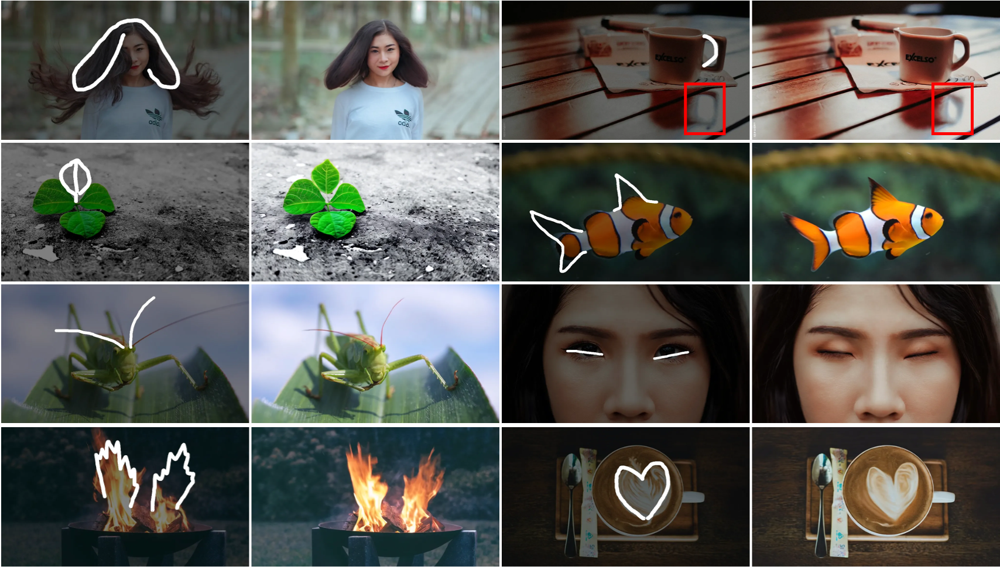

# FramePainter
Official pytorch implementation of "FramePainter: Endowing Interactive Image Editing with  Video Diffusion Priors"

# Demo
https://github.com/user-attachments/assets/8e04dfce-2750-4196-8a73-b6bab833fdb1

## News
* [01/04/2025] Code will be available as soon as possible!
  
## Gallery

 

FramePainter allows users to manipulate images through intuitive sketches.
Benefiting from powerful video diffusion priors, it not only enables intuitive and plausible edits in common scenarios, but also exhibits exceptional generalization in out-of-domain cases, e.g., transform the fish into shark-like shape.

## Acknowledgement

This repository borrows code from [Diffusers](https://github.com/huggingface/diffusers) and [ControlNext](https://github.com/dvlab-research/ControlNeXt). Thanks for their contributions!

